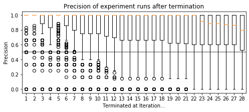
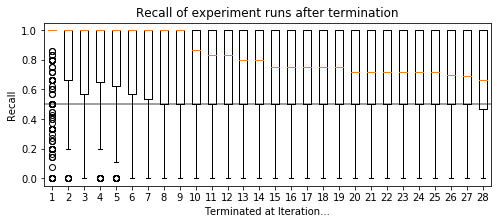

## Controlled Experiment Setup (RQ1)

### Precision and Recall of Terminating Experiments (cf. Sectionm 4.3.1)
In Figure 5a, we only report the F1 score of our experiments. To provide a complete picture, see below the same visualization, but for the precision and recall (from which the F1 score is computed).

### Characteristics of Non-Terminating Experiments (cf. Section 4.3.1)
A small portion of experiments in our controlled setup did not terminate within the limit of 30 iterations. Our interpretation is that the number of measurements per iteration was set too small for such cases. In the following, we outline characteristics of this portion of experiments. In brief, mnost experiments had a high number of change points (10) as well as a low number of measurements (2,500).

We 

## Relative Measurement Effort
